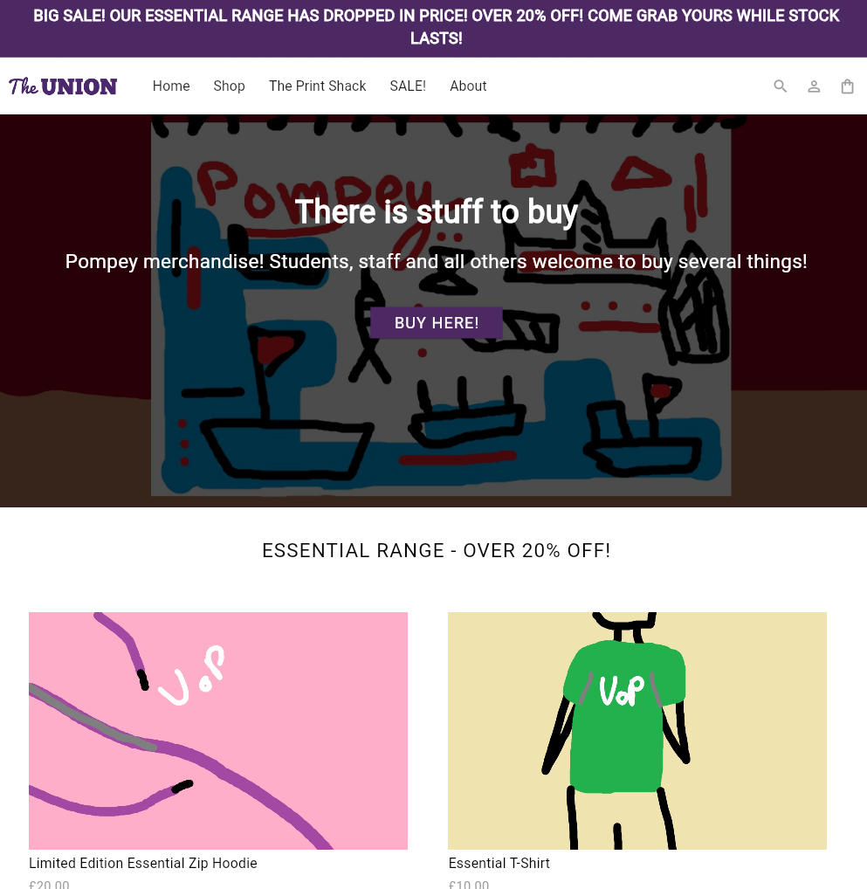

# Union Shop

A Flutter-based e-commerce mobile application recreating the University of Portsmouth Student Union Shop ([shop.upsu.net](https://shop.upsu.net)). This project provides a modern, responsive shopping experience for students and staff to browse and purchase university-branded merchandise.


*Homepage featuring product collections and promotional banners*

## 📱 About the Application

Union Shop is a mobile-first e-commerce platform built with Flutter, designed to showcase the University of Portsmouth Student Union's range of clothing, merchandise, and branded products. The application provides an intuitive shopping experience with product browsing, cart management, and user authentication features.

## ✨ Features

### Core Functionality

- **Homepage**: Featured product collections and promotional banners showcasing the latest ranges
- **Product Browsing**: Browse multiple product collections including Essential Range, Signature Range, and Portsmouth City Collection
- **Product Details**: Detailed product pages with size selection, quantity adjustment, and add-to-cart functionality
- **Shopping Cart**: View cart contents, see item counts, and manage selected products
- **Collections**: Explore organized product collections across different categories
- **Navigation**: Seamless page navigation with a responsive header and footer
- **About Page**: Information about the Union Shop and its services
- **Authentication UI**: Login and signup interface for user account management

### User Interface

- **Responsive Header**: Mobile-optimized navigation bar with menu, search, and cart icons
- **Product Cards**: Visual product displays with images, titles, and pricing
- **Footer**: Comprehensive footer with links and contact information
- **Mobile-First Design**: Optimized for mobile viewing with responsive layouts

## 🛠️ Technologies & Packages

### Flutter SDK
- **Version**: SDK >=2.17.0 <4.0.0
- **Framework**: Flutter (latest stable)

### Dependencies
- `flutter`: Flutter SDK
- `cupertino_icons: ^1.0.0`: iOS-style icons

### Development Dependencies
- `flutter_test`: Testing framework
- `flutter_lints: ^6.0.0`: Linting rules for code quality

## 🚀 Getting Started

### Prerequisites

- Flutter SDK installed ([Installation Guide](https://docs.flutter.dev/get-started/install))
- An IDE (VS Code or Android Studio recommended)
- Git for version control

### Installation

1. Clone the repository:
   ```bash
   git clone https://github.com/YOUR-USERNAME/union_shop.git
   cd union_shop
   ```

2. Install dependencies:
   ```bash
   flutter pub get
   ```

3. Run the application:
   ```bash
   flutter run -d chrome
   ```

### Running on Web (Recommended)

This application is optimized for web viewing in mobile mode:

1. Start the app in Chrome:
   ```bash
   flutter run -d chrome
   ```

2. Open Chrome DevTools (F12 or right-click → Inspect)

3. Enable "Toggle device toolbar" and select a mobile device (e.g., iPhone 12 Pro)

## 🧪 Testing

Run the test suite:
```bash
flutter test
```

The project includes widget tests for key pages to ensure functionality and UI consistency.

## 🎨 Design Features

- **Color Scheme**: Purple branding (`#4d2963`) matching University of Portsmouth identity
- **Typography**: Clean, modern fonts with appropriate sizing for mobile
- **Layout**: Grid-based product displays with responsive breakpoints
- **Navigation**: Intuitive routing between pages with persistent header/footer

## 📝 Models & Data Structure

### Product Model
- Product types: Hoodie, T-Shirt, Notebook, and more
- Clothing sizes: Small, Medium, Large
- Product images and pricing

### Cart Model
- Add/remove items with quantity management
- Price calculation with `PricingRepository`
- Cart item counting and total price computation

## 🔄 Navigation Routes

- `/` - Homepage
- `/product` - Product detail page
- `/about` - About us page
- `/auth` - Authentication page
- `/shop` - Collections overview
- `/collection` - Single collection view
- `/cart` - Shopping cart

## 👥 Contributing

This project is part of university coursework. For questions or issues, refer to the course materials or contact the module instructor.

## 📄 License

This project is developed for educational purposes as part of the University of Portsmouth coursework.

## 🙏 Acknowledgments

- Original website: [shop.upsu.net](https://shop.upsu.net)
- University of Portsmouth Student Union
- Flutter community and documentation

---

**University of Portsmouth** | Module: Programming Applications and Programming Languages (M30235) / User Experience Design and Implementation (M32605)
